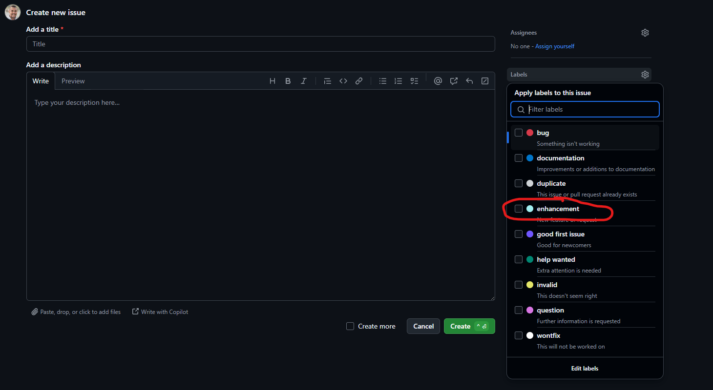
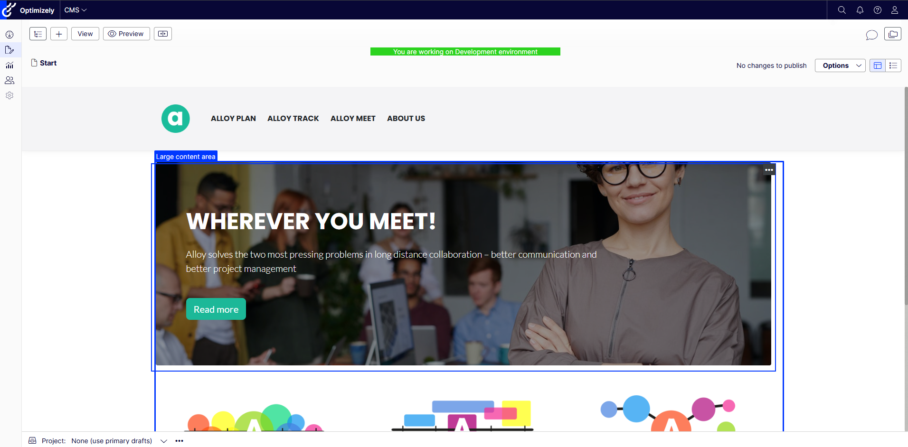
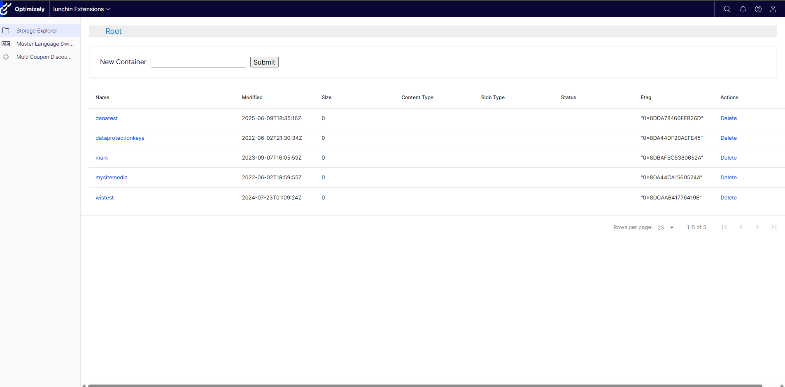
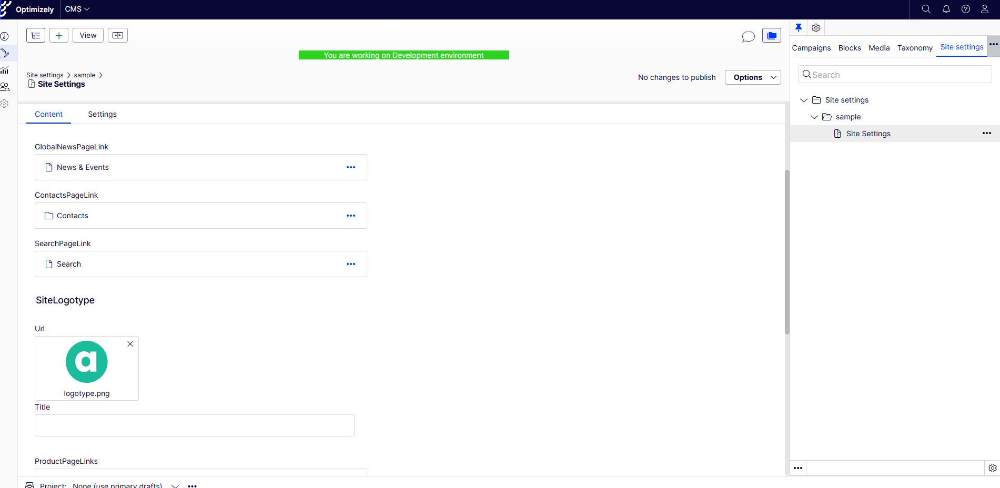
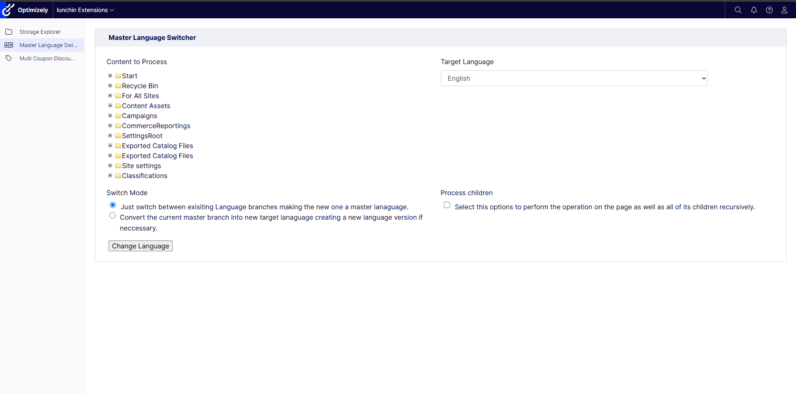
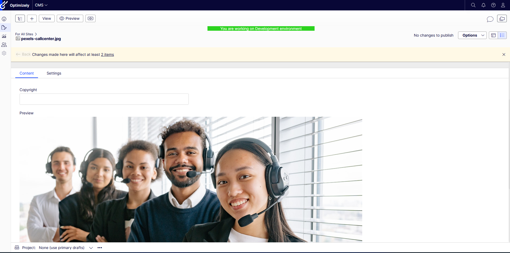
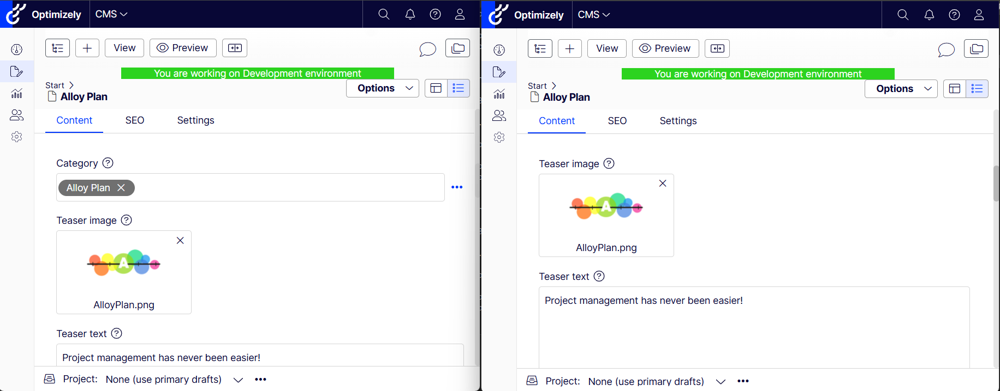
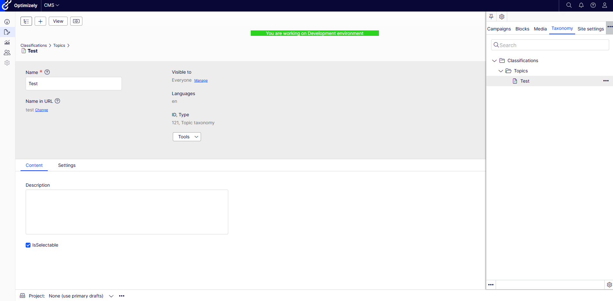
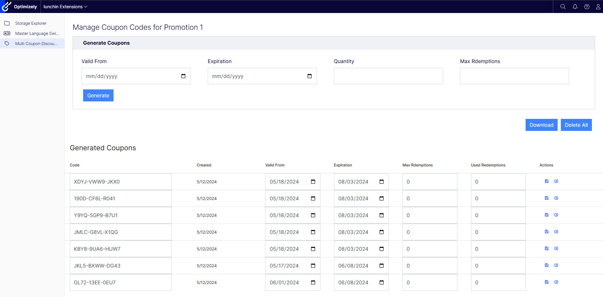
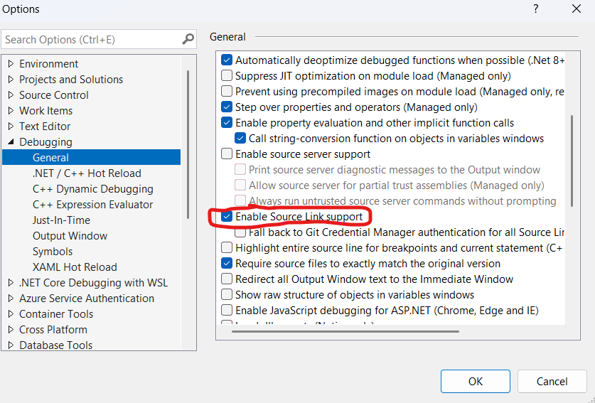

# optimizely-cloud-extensions

[](https://docs.microsoft.com/en-us/dotnet/)
[](http://world.episerver.com/cms/)
[](https://github.com/lunchin/optimizely-cloud-extensions/blob/main/license.txt)


[Overview](#overview)

[Installation and Configuration](#installation-and-configuration)

[Features](#features)

[Debug with Source Link](#debug-with-sourcelink)

## Overview

**lunchin.Optimizely.Cloud.Extensions** and **lunchin.Optimizely.Cloud.Extensions.Commerce** are two packages that offer common extensions and tools when working with the Optimizely PASS CMS and Commerce platforms.  Some of the features I created for [foundation](https://github.com/episerver/Foundation), others based on projects needs, and some have been incorporated because there was no CMS 12 version.  If there are additional suggestions for tools please feel free to add [feature request](https://github.com/lunchin/optimizely-cloud-extensions/issues/new).



## Installation and Configuration

Install **lunchin.Optimizely.Cloud.Extensions** or **lunchin.Optimizely.Cloud.Extensions.Commerce** from the Optimizely Nuget feed.

To configure the CMS package add the following to Startup
```C#
public void ConfigureServices(IServiceCollection services)
{
    services..AddlunchinOptimizelyCloudExtensions(_configuration);
}

public void Configure(IApplicationBuilder app, IWebHostEnvironment env)
{
    app.UselunchinOptimizelyCloudExtensions();
    app.UseAuthentication();
    app.UseAuthorization();
}
```

To configure the Commerce package add the following to Startup
```C#
public void ConfigureServices(IServiceCollection services)
{
    services..AddlunchinOptimizelyCommerceCloudExtensions(_configuration);
}

public void Configure(IApplicationBuilder app, IWebHostEnvironment env)
{
    app.UselunchinOptimizelyCommerceCloudExtensions();
    app.UseAuthentication();
    app.UseAuthorization();
}
```

## Features

Every feature in both packages can be disabled.  By default all features are enabled and you must explicitly disable the feature. Here are examples on how to disable.

### Disable Feature Through Configuration Files
```json
{
    "loce" : {
        "extensions" : {
            "EnvironmentBannerEnabled" : false,
            "StorageExplorerEnabled" : false,
            "MasterLanguageEnabled" : false,
            "SettingsEnabled" : false,
            "SiteHostnameInitializationEnabled" : false,
            "ImagePreviewEnabled" : false,
            "TaxonomyEnabled": false,
            "HideDefaultCategoryEnabled": false
        },
        "commerceextensions" : {
            "MultiCouponsEnabled": false
        }
    }
}
```

### Disable Feature Through Startup
```C#
services.PostConfigure<ExtensionsOptions>(o =>
{
    o.EnvironmentBannerEnabled = false;
    o.HideDefaultCategoryEnabled = false;
    o.ImagePreviewEnabled = false;
    o.MasterLanguageEnabled = false;
    o.SettingsEnabled = false;
    o.SiteHostnameInitializationEnabled = false;
    o.StorageExplorerEnabled = false;
    o.TaxonomyEnabled = false;
    
})
.PostConfigure<CommerceExtensionsOptions>(o =>
{
    o.MultiCouponsEnabled = false;
});
```

### Environment Banner

This feature adds a banner in edit mode so you know which environment you are on.  This tool is probably not needed if you are using Optimizely Identity because it shows which environment you are working in as well.



There are two configuration options control the background and text colors.

#### Configuration Files
```json
{
    "loce" : {
        "extensions" : {
            "EnvironmentBannerBackgroundColor" : "#2cd31f",
            "EnvironmentBannerTextColor" : "#ffffff",
        }
    }
}
```

#### Through Startup
```C#
services.PostConfigure<ExtensionsOptions>(o =>
{
    o.EnvironmentBannerBackgroundColor = "#2cd31f";
    o.EnvironmentBannerTextColor = "#ffffff";
})
```

### Storage Explorer

This feature allows a user to browse the blob storage for the given environment.  This is useful if you need to quickly get access to logs or you need to inspect files you are storing ib blob storage.  There is also the ability to upload files as well.



### Site Settings

This feature allows a user to create setting types which will be created for each site.  This is useful to be able to have separate publishing flow for settings rather than having to publish the home page if the settings are kept there.



### Master Language Switcher

This feature allows you to change the master language of a content.  This is useful because they only way to do this otherwise is create a new content and manually copy over all the fields which also lose the link to the other language versions if there are any.



### Forms Mode Image Preview

This feature allows you to preview the image in Forms mode which is useful if you need to add meta data about the image, you can see right where you need to edit the content.



Add the following property to your image types

```C#
[UIHint(Constants.FormImagePreview)]
[Display(
        GroupName = SystemTabNames.Content,
        Name = "Preview",
        Order = 999999999)]
public virtual string FormPreview { get; set; }
```

### Hide Default Category

This feature allows you to hide the default category provided by Optimizely out of the box.  This is useful if you are using another taxonomy tool like the feature provided by this CMS package.



### Site hostnames initialization

This feature allows you to configure hostnames for each of the sites in your Optimizley instance per environment.  This is useful for copy down locally, or to inegration and preproduction environments.  Production is never altered. 

You must specify the site name and the hostnames to add.  The first one listed will be considered the primary domain.

#### Configuration Files
```json
{
    "loce": {
        "extensions": {
            "Sites": [
                {
                    "Name": "Site 1",
                    "Hostname": "localhost:5000,localhost:3000"
                },
                {
                    "Name": "Site 2",
                    "Hostname": "localhost:5001"
                }
            ]
        }
    }
}
```

#### Through Startup
```C#
services.PostConfigure<ExtensionsOptions>(options =>
{
    options.Sites = [
        new Site
        {
            Name = "Site 1",
            Hostname = "localhost:5000,localhost:3000"
        },
        new Site
        {
            Name = "Site 2",
            Hostname = "localhost:5001"
        }
    ];
});
```

### Taxonomy

This feature allows you to crate taxonomy content which you can use to implement categories, tags, etc to search and filter content.  Since it is standard content will work in both Optimizely Graph as well as Search and Navigation.  This just sets up a base abstract content type, you will need to create your own to use.



#### Example content type
```C#
[AvailableContentTypes(Availability = Availability.Specific, Include = [typeof(ClassificationData)])]
[ContentType(GUID = "be6f1bd4-5bba-498c-95be-d790b068a677",
    DisplayName = "Topic taxonomy",
    GroupName = GroupNames.Content,
    Order = 300)]
public class Topic : ClassificationData
{
}
```

### Multi Coupon Code Provider

This feature adds the ability for promotions in Optimizely Commerce Connect to have multiple coupon codes instead of the default one that is out of the box.  This is useful if you want to support sending individual discount codes to customers for different reasons.



#### Scheduled Job
There is a Delete expired coupon job that is responsible for cleaning up expired coupons.  It is disabled by default and should be turned on to run once per day if using this feature.

## Debug with SourceLink
Both packages are Source Link enabled and the nuget packages contain the pdbs. 

To enable source link under Options => Debug, enable source link.



 In order to get the pdbs to the output folder, you will need to add the following target to your csproj file.  You will need to update this target every time you upgrade your package.

```xml
<Target Name="CopyPdbsFromNuGet" AfterTargets="ResolvePackageAssets">
	<ItemGroup>
		<NuGetPdbs Include="$(NuGetPackageRoot)\lunchin.Optimizely.Cloud.Extensions\1.0.9\lib\**\*.pdb" />
		<NuGetPdbsCommerce Include="$(NuGetPackageRoot)\lunchin.Optimizely.Cloud.Extensions.Commerce\1.0.9\lib\**\*.pdb" />
    </ItemGroup>
	<Copy SourceFiles="@(NuGetPdbs)" DestinationFolder="$(OutputPath)" SkipUnchangedFiles="true" />
	<Copy SourceFiles="@(NuGetPdbsCommerce)" DestinationFolder="$(OutputPath)" SkipUnchangedFiles="true" />
</Target>
```